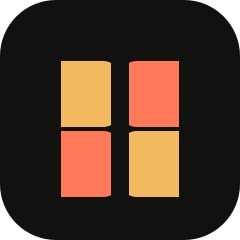

# BESURE

<p align="center">
  
</p>

<h1 align="center">BESURE</h1>

<p align="center"><strong>An elite community platform powering 3D action &amp; adventure game makers.</strong></p>
<p align="center">Persistent project showcases · UNICON exhibition feedback loops · High-framerate playable builds</p>

<p align="center">
  <a href="https://unidev.xyz/"></a>
  <a href="https://github.com/chaomazo/unidev"></a>
  <a href="https://www.gnu.org/licenses/agpl-3.0.html"></a>
</p>

<p align="center">
  <a href="https://github.com/chaomazo/unidev/stargazers"></a>
  <a href="https://github.com/chaomazo/unidev/network/members"></a>
  <a href="https://github.com/chaomazo/unidev/commits/main"></a>
</p>

BESURE is a home for people who make games with motion, atmosphere, and a point of view. The platform is designed around the work that actually matters: putting a playable build in front of another human, getting useful critique, and shipping the next slice with more intention.

## The loop

<table>
<tr>
<td width="25%"><strong>01 · SHOWCASE</strong><br><br>Give every project a persistent home with its build, context, changelog, and creative intent.</td>
<td width="25%"><strong>02 · PLAYTEST</strong><br><br>Let peers experience the work in a browser or through a downloadable build, without losing the thread.</td>
<td width="25%"><strong>03 · CRITIQUE</strong><br><br>Turn reactions into structured feedback around game feel, clarity, pacing, and performance.</td>
<td width="25%"><strong>04 · SHIP</strong><br><br>Group recurring signals into a focused build brief. The creator decides what earns a place in the next slice.</td>
</tr>
</table>

## What is here now

- **A visual landing experience** in [site/](./site/) shaped around the BESURE / UNICON world.
- **A custom vector mark** in [assets/besure-mark.svg](./assets/besure-mark.svg), designed to stay sharp from a favicon to a booth banner.
- **A clear product narrative** for showcases, playtests, community critique, and high-framerate builds.
- **An inspectable Python workspace starter** retained from the repository's earlier Besure foundation while the platform layer grows.

Open the local experience with any static server:

```bash
git clone https://github.com/chaomazo/unidev.git
cd unidev
python -m http.server 4173 --directory site
```

Then visit http://localhost:4173.

## Repository map

| Path | Purpose |
| --- | --- |
| [site/](./site/) | Responsive BESURE landing page and interaction layer |
| [assets/](./assets/) | Brand primitives, starting with the BESURE mark |
| [docs/BRAND.md](./docs/BRAND.md) | Visual language, voice, and logo usage |
| [docs/ARCHITECTURE.md](./docs/ARCHITECTURE.md) | Product surfaces and implementation direction |
| [besure/](./besure/) | Legacy Python workspace bootstrap retained for migration safety |
| [tests/](./tests/) | Existing test coverage for the legacy workspace CLI |

## Product direction

### Persistent showcases

A project should not disappear when a jam ends. Each showcase is a durable page for the build, the people behind it, its current state, known rough edges, and the feedback that shaped the next version.

### UNICON feedback loops

UNICON is the exhibition layer: a year-round rhythm of playable drops, peer critique, mentor reviews, and public judging. Feedback should be specific enough to act on and human enough to feel like a conversation.

### High-framerate builds

The experience should respect the craft. Performance, input feel, frame pacing, and the difference between a captured trailer and a playable slice are first-class parts of the showcase.

## Design language

BESURE pairs **reflective obsidian** with **warm amber signal light**: cinematic without becoming ornamental, technical without looking like a dashboard. The mark is a split aperture that suggests a portal, a play button, and two creators meeting around a build.

Read the full system in [docs/BRAND.md](./docs/BRAND.md).

## Roadmap

- [x] Establish BESURE identity, positioning, and public landing foundation
- [x] Add a responsive showcase-oriented site starter
- [x] Define the persistent showcase and critique loop
- [ ] Add creator profiles and project publishing
- [ ] Add browser playtest embeds with build metadata
- [ ] Add structured review threads and creator replies
- [ ] Ship UNICON exhibition mode and judging rubric

## Contributing

The best contribution is a sharper build, a more useful critique, or a small piece of infrastructure that helps creators do either one. Start with [CONTRIBUTING.md](./CONTRIBUTING.md), keep changes focused, and explain the user-facing reason behind them.

## License

BESURE is released under the GNU Affero General Public License v3.0. See the AGPLv3 metadata in [pyproject.toml](./pyproject.toml) and the official license text at https://www.gnu.org/licenses/agpl-3.0.html.
